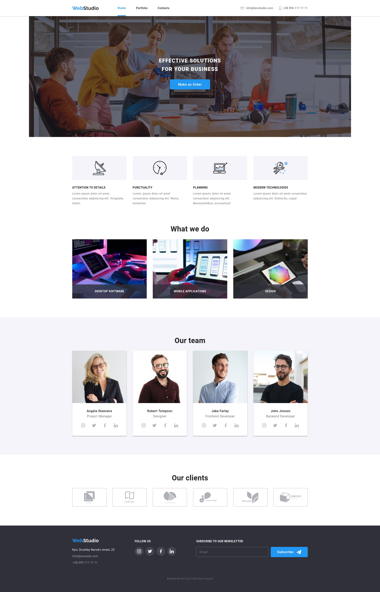
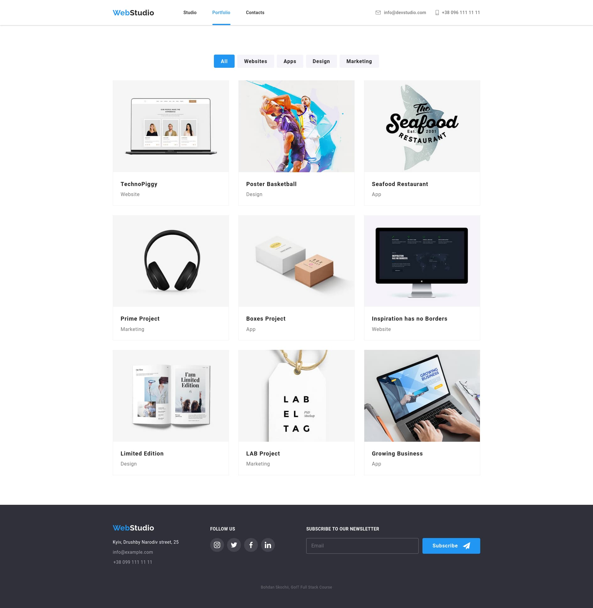
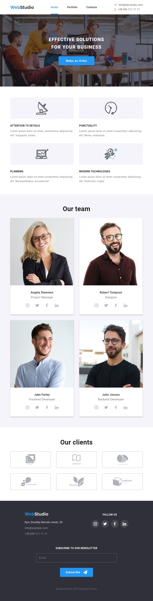
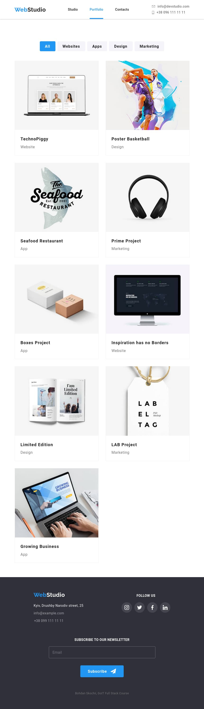
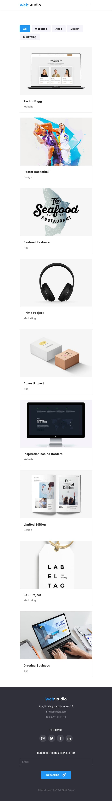

# Final project of the HTML and CSS module

This is the result of 8 modules, 16 week HTML + CSS course. From basic knowledge
to the full fledged professional looking website

Semantic HTML markdown. Accessibillity.

CSS. Classes, pseudo-classes, selectors, fonts, colors text pseudo-elements,
box-model, structural pseudo-classes

Flexbox, containers, elements geometry

Decorative effects and elements.

Pseudoelements, gradients, images, vector graphics

SVG elements, icons, working with vector sprites. Optimization of icons and
images

Positioned elements, z-index transitions, animation

Forms elements, form validation

BEM methodology, SASS pre-processor

Adaptive and responsive layout and graphics

Modal windows mobile menus, basic Javascript

